Homework 3 - Bayes Coding
================
Solutions
April 21, 2026

## Load packages and data

``` r
library(ggplot2)
```

    ## Warning: package 'ggplot2' was built under R version 4.4.3

## Exercise 1 - Bioassay

### Part a

Here is my version of the commented code

``` r
# bioassay.r 
# Example:analysis of biossay expriment
# Gelman and Rubin book, page 82
    
#A function to set the data and the grid range for alpha and beta
#LL is the number of values in the grid, higher LL will take more time, but be smoother
input <- function(LL=100){
#Read in the data for four experiments with 5 animals each
#Highest and lowest doses have been correcgted away form 0% and 100%
  biossay <- data.frame(doses=c(-.863,-.296,-.053,.727),
               rats=c(5,5,5,5),deaths=c(0.5,1,3,4.5),freq=c(0.5,1,3,4.5)/5)
  DD      <- data.frame(y=log((biossay$freq)/(1-biossay$freq)),x=biossay$doses)
#SLR estimates and standard errors of alpha and beta
  estimates <- lm(y~x,data=DD)
  alpha.hat <- summary(estimates)$coeff[1,1]
  std.alpha <- summary(estimates)$coeff[1,2]
  beta.hat  <- summary(estimates)$coeff[2,1]
  std.beta  <- summary(estimates)$coeff[2,2]
#based on the SLR estiamtes, we choose a range of values for the alpha and beta grids
  alpha       <- seq(-2,2,length=LL)
  beta       <-  seq(-5,10,length=LL)
#return a named list to keep the code working without errors
  return(list(biossay=biossay,estimates=estimates,alpha=alpha,beta=beta))
}

#A function to evaluate the unnormalized log-posterior of alpha and beta for given data
log.post<-function(alpha,beta,data=DD$biossay){
  ldens <- 0
  for (i in 1:length(data$doses)){
#first computer the probabilities of death (theta) for given alpha and beta
    theta <- 1/(1+exp(-alpha-beta*data$doses[i]))
#then, add up the log-posterior pieces, one for each dose
    ldens  <- ldens + data$deaths[i]*log(theta)+(data$rats[i]-data$deaths[i])*log(1-theta)
  }
  ldens
}

#A function to plot the joint posterior of alpha and beta 
#the contours come from the log.posterior
#the points come from the posterior samples
plot.joint.post<-function(data,draws){
  contours <- seq(.05,.95,.1)
# for every combination of alpha and beta on the grid, calculate the unnormalized log-posterior
   logdens <-outer(DD$alpha,DD$beta,log.post)
# subtract the max value (so the max is now 0) and then exponentiate the log-posterior
  dens<-exp(logdens-max(logdens))
#draw contour lines from the unnormalized posterior distribution (max is 1, min is 0)
  contour(DD$alpha,DD$beta,dens,levels=contours,xlab="alpha",ylab="beta")
#draw the points samples from the posterior
  points(draws$post.alpha,draws$post.beta)
  mtext("Posterior density",3,line=1,cex=1.2)
}

#A function that calculates the posterior distribution of alpha and beta, normalized over the grid
grid.value<-function(data=DD$biossay,alpha,beta){
  ll    <- length(alpha)
#assuming the grid is square, the posterior distribution is evaluated on an ll x ll matrix
  PP    <- matrix(NA,ll,ll)
  for(i in 1:ll){ 
    for(j in 1:ll){
#the unnormalized posterior at each grid point
      PP[i,j]<-exp(log.post(alpha[i],beta[j],data)) 
    }}
#normalizing the distribution over the grid 
  return(PP/sum(PP))
}


#A function to sample M values of alpha and beta 
# PP is the distribution normalized over the grid
# alpha and beta are the possible values in the grid axes
sampling<-function(M=100,PP,alpha,beta){
#marginal distribution over alpha grid values
  alpha.mar<-apply(PP,1,sum)
#The marginal cummulative distribution for alpha 
  alpha.cdf  <-  cumsum(alpha.mar)

  post.alpha  <-  rep(0,M)
  post.beta  <-  rep(0,M)
  for( m in 1:M){
    uuu<-runif(1,0,1)
    Fhat.alpha  <-  max( alpha.cdf[ alpha.cdf <= uuu])
# which value of alpha is sampled
    if(Fhat.alpha==-Inf) { post.alpha[m]  <- alpha[1]
    } else post.alpha[m]  <- alpha[alpha.cdf == Fhat.alpha]
# which row of the PP distribution corresponds to the choosen alpha
    junk  <- length(alpha[alpha <= post.alpha[m]])
# normalize the correct row, to get the conditional distribution for beta
    PP[junk, ]  <-  PP[junk,]/sum(PP[junk,])                                   
# the conditional cummulative distribution for beta, condidtional an alpha
    beta.cond.cdf  <-   cumsum(PP[junk,])
    uuu<-runif(1,0,1)
    Fhat.beta  <-  max( beta.cond.cdf[ beta.cond.cdf < uuu])
# which value of beta is sampled
    if(Fhat.beta==-Inf) { post.beta[m]  <- beta[1]
    } else post.beta[m]  <-  beta[beta.cond.cdf == Fhat.beta]    
  }
#return a named list to keep the code working without errors
  return(list(post.alpha=post.alpha,post.beta=post.beta))
}

#Bonus points!! add a random seed!
set.seed(1770)
# create a grid with 200 values each of alpha and beta
DD <- input(LL=200)
# calculate the posterior probabilities at each value in the grid from DD
PP <- grid.value(DD$biossay,DD$alpha,DD$beta)
#not yet running these lines for later parts:
# draw 1000 samples from the posterior distribution
#draws <- sampling(M=1000,PP,DD$alpha,DD$beta)
# plot the posterior draws
#plot.joint.post(DD$bioassay,draws)
```

### Part b

Likelihood:
$p(y|\alpha,\beta) = \prod_{j=1}^4\theta^{y_i}(1-\theta_j)^{n_j-y_j}$,
where $\theta_j = (1+exp(-\alpha-\beta*d_j))^{-1}$ and $d_j$ is the
$j^{th}$ dose.

Prior: $p(\alpha,\beta) \propto 1$.

### Part c

Stan code as a text file.

      data{ 
        int<lower=0> N; //number of groups
        vector[N] d;    //doses per group
        array[N] int<lower=0> y;    //deaths per group
        array[N] int<lower=0> n;    //group sizes / rats per group
      }

      parameters{
        real alpha;  // uses default prior
        real beta;   // uses default prior
      }
      transformed parameters{
        vector[N] theta;
          theta = 1/(1+exp(-alpha-beta*d));
      }
      
      model{
        y ~ binomial(n, theta);   //likelihood - vectorized binomial
      } // would also work as a loop

### Part d

running the commented out part of a:

``` r
draws <- sampling(M=1000,PP,DD$alpha,DD$beta)
```

    ## Warning in max(alpha.cdf[alpha.cdf <= uuu]): no non-missing arguments to max;
    ## returning -Inf

``` r
#A version that only plots the contours
plot.joint.post(DD$bioassay,list(post.alpha=NA, post.beta=NA))
```

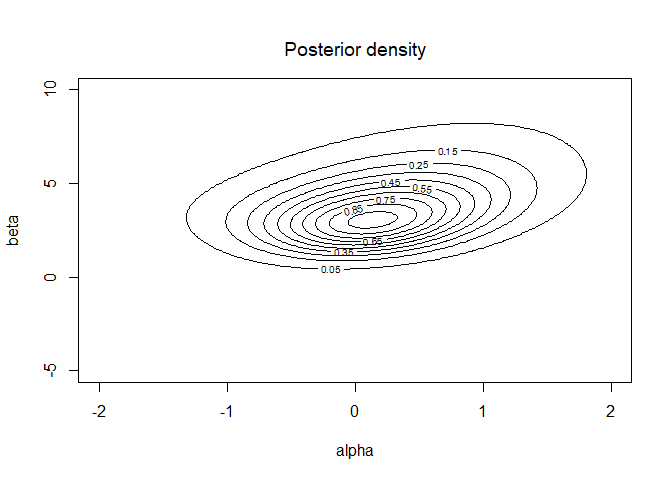<!-- -->

### Part e

``` r
a = sum(draws$post.beta>0)/length(draws$post.beta)
```

99.5% of my samples had $\beta>0$.

In this problem, $\beta>0$ means that there is an increasing
relationship between dose and death.

### Part f

Recall that LD50 = $-\alpha/\beta$

``` r
LD50 = (-draws$post.alpha/draws$post.beta)[draws$post.beta>0]
quantile(LD50, c(.5, .025, .975))
```

    ##         50%        2.5%       97.5% 
    ## -0.04954128 -0.37320885  0.46165834

``` r
hist(LD50, nclass =50)
```

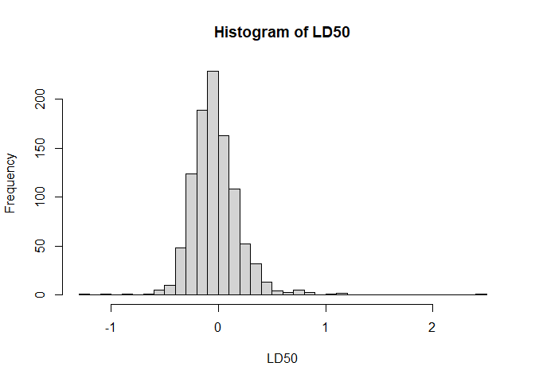<!-- -->

### Part g

For the code in (a), the log posterior would now include parts for the
two normal priors, but these are just dnorm(alpha,0,2, log=TRUE) and
dnorm(beta,0,10, log=TRUE) and get added to the likelihood part in the
code.

For the code in (c), the priors just gets changed for $\alpha$ and
$\beta$ in the model section:

        alpha ~ normal(0,4);
        beta ~ normal(0,100);

## Exercise 2 - Hierarchical binomial model

### Part a

Dropping everything that is not $\theta$:

Integrating ten times over all the $\theta$’s:

### Part b

I just set u.grid and v.grid and run the provided code (with the u.grid
and v.grid lines commented out). It makes a contour plot of the joint
posterior over the range of values provided. Here’s my guesses:

``` r
u.grid <- seq(0.1,10,,100)
v.grid <- seq(0.1,10,,100)
source("bicycles-snippet.R")
```

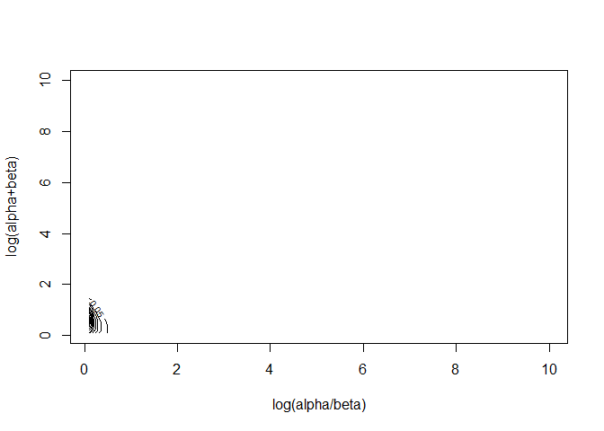<!-- -->

``` r
u.grid <- seq(-2,2,,100)
v.grid <- seq(-2,2,,100)
source("bicycles-snippet.R")
```

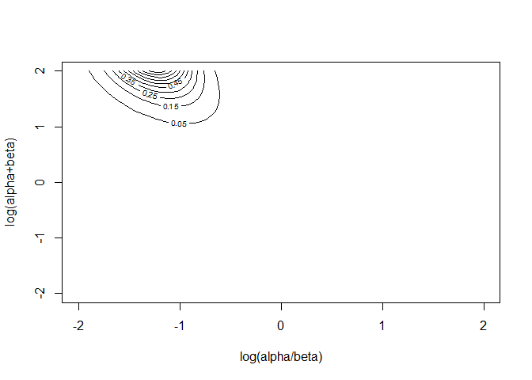<!-- -->

``` r
u.grid <- seq(-2,2,,100)
v.grid <- seq(-2,4,,100)
source("bicycles-snippet.R")
```

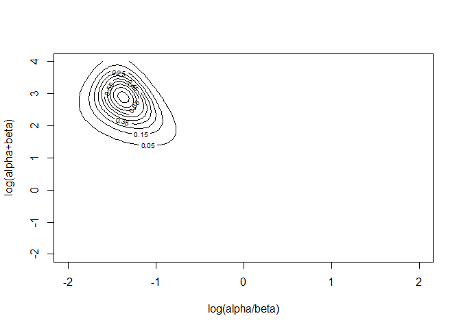<!-- -->

``` r
u.grid <- seq(-3,0,,100)
v.grid <- seq(0,6,,100)
source("bicycles-snippet.R")
```

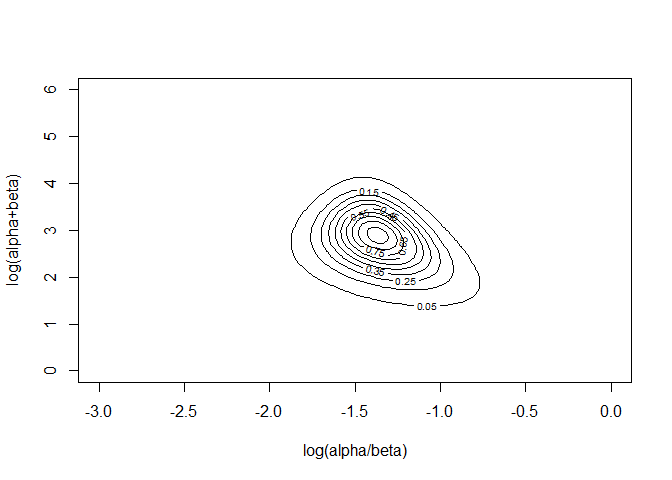<!-- -->

### Part c

The code snippet makes a matrix post, which is 100 $\times$ 100 and
contains the normalized probabilities of all the pairs of u and v
values. I find the rowSums(post) to get the marginal distribution of u,
over the u.grid values. I sample the index (sampsi) of the u’s instead
fo the values so that I can take the right row of the post matrix in the
next step. Once we picked row sampsi\[i\] of the u’s, I can pick out the
values from the u.grid vector. We use the same picked row, sampsi\[i\],
to get the conditional distribution of v’s. For the v’s, I don’t need
the index for anything, so I just sample from the values.

For each (u,v) pair, I calculate alpha and beta. These are used to
sample $n$ theta’s from the conditional posterior for theta.

You don’t need to show a hexbin, but plotting the 5000 (u,v) pairs is
not very revealing, so I show that the samples follow the contours from
the last part. I asked for the 12 marginal histograms for alpha, beta,
and 10 theta’s.

``` r
sampsi = sample(1:100, 5000, replace=T, prob=rowSums(post))
sampsu=u.grid[sampsi]
sampsv=rep(NA, 5000)
for(i in 1:5000)
sampsv[i] = sample(v.grid, 1, replace=T, prob=post[sampsi[i], ])
sampst = array(NA, c(length(y), 5000))
for(i in 1:5000)
{
  u=sampsu[i]; v=sampsv[i]
  a <- (exp(u)*exp(v))/(exp(u)+1)
  b <- exp(v)/(exp(u)+1)
  for(j in 1:length(y))
    sampst[j,i] = rbeta(1, a+y[j], b+n[j]-y[j])
}

library(hexbin)
```

    ## Warning: package 'hexbin' was built under R version 4.4.3

``` r
plot(hexbin(sampsu, sampsv, xlab="log(alpha/beta)", ylab="log(alpha+beta)"))
```

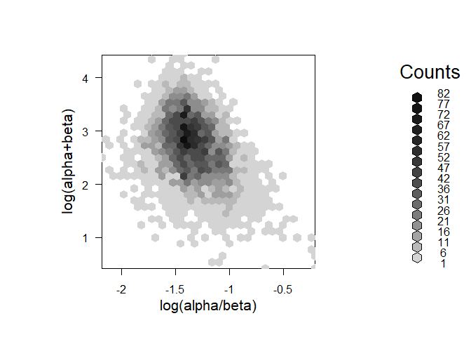<!-- -->

``` r
hist(sampsu)
```

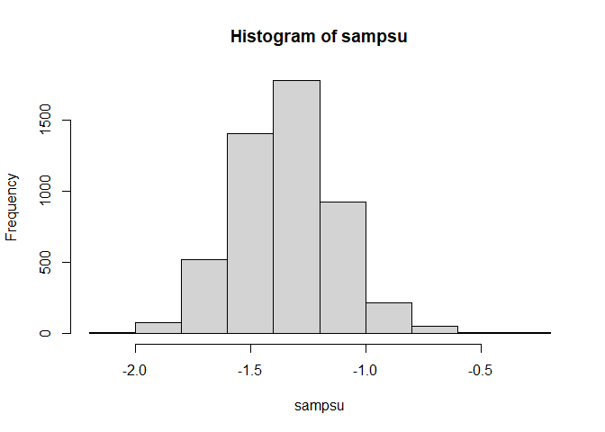<!-- -->

``` r
hist(sampsv)
```

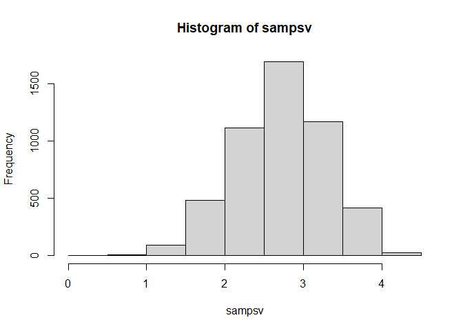<!-- -->

``` r
for(j in 1:length(y))
{
  hist(sampst[j,], main=paste0("Histogram of theta",j), xlab=paste0("theta",j))
}
```

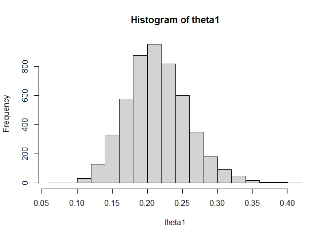<!-- -->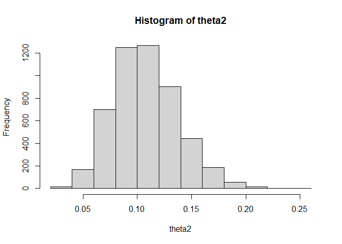<!-- -->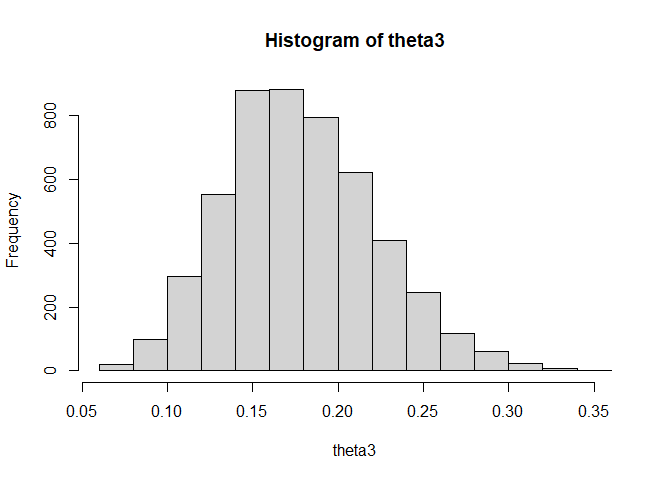<!-- -->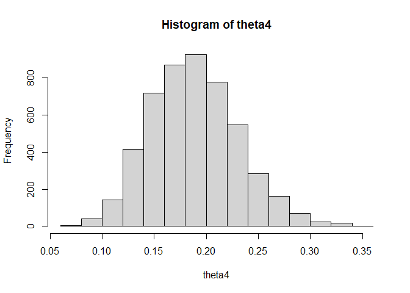<!-- -->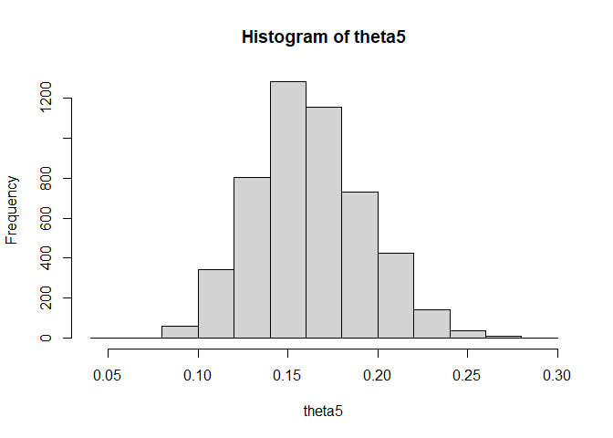<!-- -->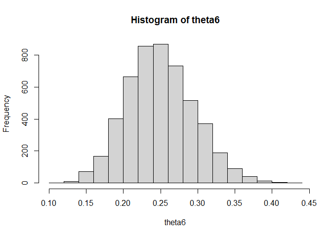<!-- -->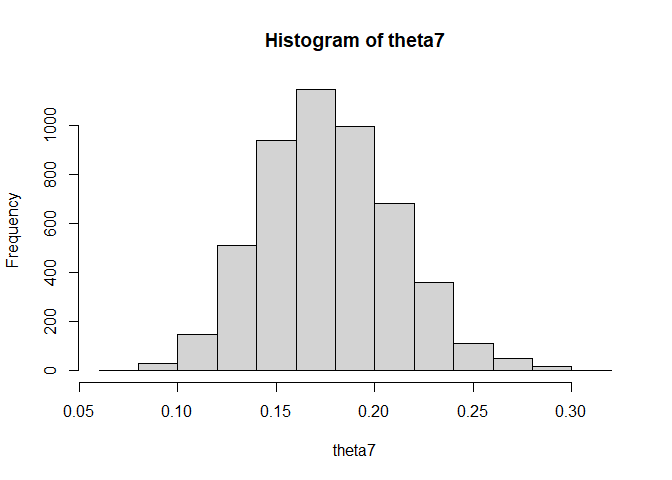<!-- -->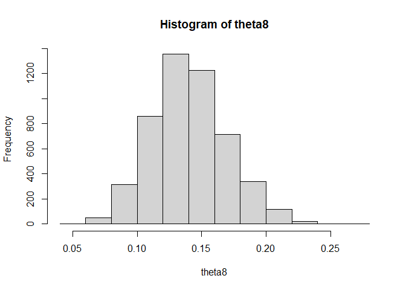<!-- -->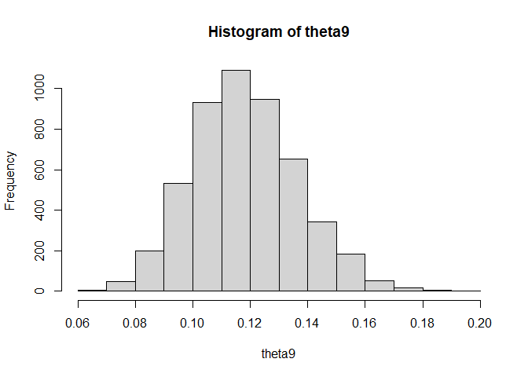<!-- -->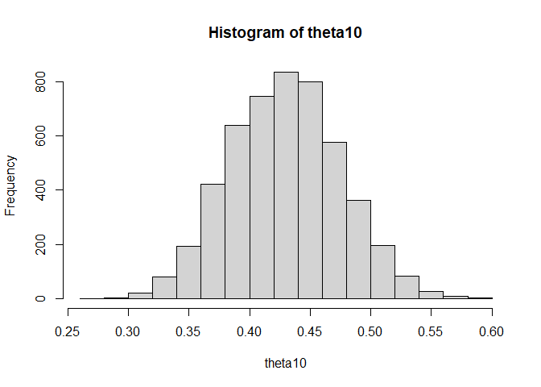<!-- -->

### Part d

The posterior means are similar to the raw proportions, but they are
shrunk towards the overall proportion and the shrinking is a bit more
for the locations with the largest and smallest raw proportions.

I rewrote this, but you could have also looked at the bioassay example
plot code:

``` r
par(mar=c(4,4,1,1))
plot(0,0, type='n', xlim=c(0,.6), ylim=c(0,.6), xlab="raw proportions", ylab="posterior intervals")
abline(0,1, lty=2)
abline(h=sum(y)/sum(n), lty=2)
for(j in 1:length(y))
{
  points(y[j]/n[j], mean(sampst[j,]))
  lines(c(y[j]/n[j],y[j]/n[j]), quantile(sampst[j,],c(.025,.975)))
}
```

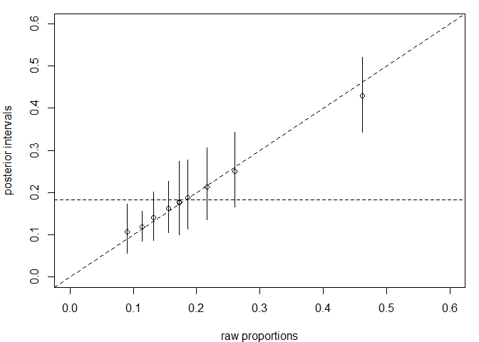<!-- -->
